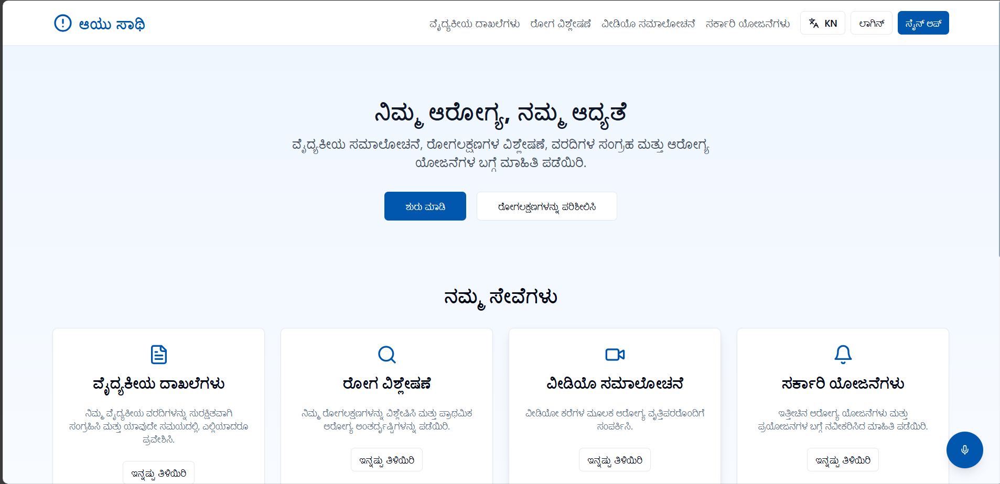

# Ayu-Saathi 💊🌿

**Ayu-Saathi** is a bilingual healthcare platform designed especially for people in **rural and semi-urban areas**, where access to quality medical care is often limited. It empowers users with easy, affordable, and accessible healthcare solutions by bridging the communication, knowledge, and economic gaps in the current system.

---

## 🧩 Real-World Problems Addressed

- 📞 **Improper Communication** with healthcare providers  
- 🌐 **Language Barrier** for non-English speakers  
- 📚 **Lack of Knowledge** about medical terms and conditions  
- 🏥 **Limited Access** to specialized doctors  
- 💸 **Economic Challenges** in affording quality healthcare  

---

## ✅ How Ayu-Saathi Solves These

- 🗣️ **Bilingual Interface** – Supports **Kannada and English**  
- 🎥 **One-on-One Video Consultations** with specialized doctors  
- 🤖 **Disease Analysis** using NLTK models (NLP) based on symptoms  
- 🔊 **Text-to-Speech (TTS)** in Kannada using **gTTS**  
- 📂 **Medical Record Management**  
- 🏛️ **Government Scheme Integration**  
- 💬 **Medical Chatbot** to simplify medical jargon  

---

## 🧪 Tech Stack

| Layer            | Technology Used                    |
|------------------|------------------------------------|
| Frontend         | React, Tailwind CSS                |
| Backend          | Node.js, Express.js                |
| Database         | MongoDB                            |
| AI & Analysis    | Python, Django, NLTK               |
| Text-to-Speech   | Google Text-to-Speech (gTTS)       |
| Video Consults   | WebRTC / Video SDK Integration     |

---

## 🖼️ Website Preview

> Below are screenshots/previews of the Ayu-Saathi platform.

| Home Page | Doctor Consultation |
|-----------|---------------------|
|  |  |

> _Tip: Save your images inside the `/assets/` folder or upload them and link with raw GitHub URLs._

---

## 🚀 Getting Started

### Prerequisites

- Node.js and npm
- Python 3.x
- MongoDB
- Django and pip dependencies

### Setup

1. **Clone the repository**

   ```bash
   git clone https://github.com/Vineetsu/Ayu-Saathi.git
   cd Ayu-Saathi
